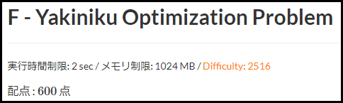

# AtCoderMyExtensions

私が作成したAtCoderのUserScript（Greasemonkey scripts）です。

*   [AtCoderMyExtensions](#atcodermyextensions)
    *   [AtCoderDifficultyDisplay](#atcoderdifficultydisplay)
        *   [Description](#description)
        *   [Install](#install)
    *   [License](#license)
        *   [Install](#install-1)

## AtCoderDifficultyDisplay

問題のページに[**AtCoder Problems**](https://kenkoooo.com/atcoder/)の**Difficulty**を表示します。

### Description

Difficultyとその問題をACしたかどうかを表示します。

Difficultyはその値により色つけされます。

その問題をACしたかどうかの表示は、その問題をコンテスト中にACした、まだ提出していない、などに応じて色つけされます。

問題点、改善点は**Issue**に書く。

### Install

1.  [**Tampermonkey**](https://chrome.google.com/webstore/detail/tampermonkey/dhdgffkkebhmkfjojejmpbldmpobfkfo?hl=ja)などのユーザースクリプトマネージャをインストールします。
2.  からユーザースクリプトをインストールします。

## License

Copyright (c) 2020 hotarunx

This software is released under the MIT License, see LICENSE.
