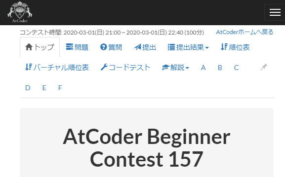

# AtCoderMyExtensions

私が作成したAtCoderのUserScript（Greasemonkey scripts）です。

1. [AtCoderDifficultyDisplay](#AtCoderDifficultyDisplay)
2. ~~[AtCoderProblemLinks](#AtCoderProblemLinks)~~

## AtCoderDifficultyDisplay

問題のページに[AtCoder Problems](https://kenkoooo.com/atcoder/)のDifficultyを表示する。

### 問題点・改善点

* 他のページでもDifficultyを表示する。
* Difficulty Circle（TopCoderでユーザーのレートを表す色付き円マーク）を表示する。
* リファクタリング。

## ~~AtCoderProblemLinks~~

<!--  -->

~~タブに問題へのリンクを追加する。~~

[atcoder-problem-navigator](https://greasyfork.org/ja/scripts/383360-atcoder-problem-navigator)がやりたいことをやってるので作るのやめます。

### ~~問題点・改善点~~

* ~~問題数が6問以外のとき、正しい数のリンクを貼れない。~~
* ~~問題idが`*_a, *_b, ...`以外のとき、誤ったリンクを貼る。~~

## License

Copyright (c) 2020 hotarunx

This software is released under the MIT License, see LICENSE.
